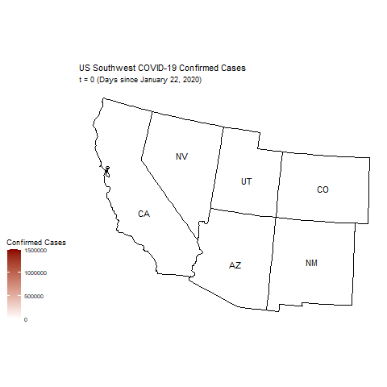
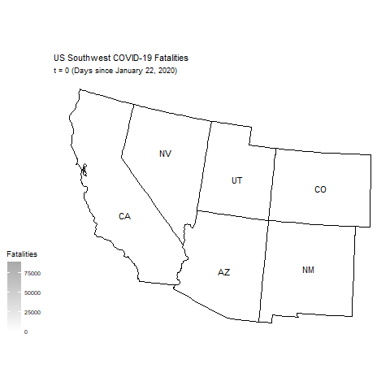

```{r include=FALSE}
library(tidyverse)
library(lubridate)
library(modelr)
library(gganimate)
library(transformr)
library(usmap)
```

## Wrangling

Imports data, preps it, and shows a snippet of what it looks like
```{r}
train_data <- read_csv("train.csv", 
    col_types = cols(
      Date = col_date(format = "%Y-%m-%d")
    )
  ) %>%
  mutate(Date = format(Date, "%Y/%m/%d")) %>%
  mutate(t = yday(Date) - 22) %>%
  select(Id, Province_State, Country_Region, t, Date, ConfirmedCases, Fatalities) %>%
  rename(Train_ID = Id) %>%
  mutate( isTrain = TRUE) #added the isTrain variable to show which data is training is which is not

head(train_data, 10)
```

Makes dataframe composed of only the US southwestern states (CA, NV, AZ, UT, NM, CO)
```{r}
sw_data <- train_data %>%
  filter(
    Province_State == "California" |
    Province_State == "Nevada" |
    Province_State == "Arizona" |
    Province_State == "Utah" |
    Province_State == "New Mexico" |
    Province_State == "Colorado"
  ) %>%
  arrange(Province_State, Date) %>%
  select(-Country_Region)

head(sw_data)
```

Now we will import the test data. 
We also set up "t", as days since 1/22/2020. 
```{r}
test_data <- read_csv("test.csv",
        col_types = cols(
          Date = col_date(format = "%Y-%m-%d"))
)

#the test data does not have ConfirmedCases and Fatalities, so we must add those
test_data <- test_data %>%
  mutate( Date = format(Date, "%Y/%m/%d")) %>%
  rename( Test_ID = ForecastId) %>%         #renaming to match the same style as Train_ID
  mutate( t = yday( Date)-22 ) %>%
  mutate( ConfirmedCases = NA, Fatalities = NA, isTrain = FALSE ) #adding these columns with NA since it will be values that we will be predicting
 

#since there is an overlap of some dates in testing and training data, we will filter out some of the dates
test_data <- test_data %>%
  filter( t > 91)

head(test_data)
```

Make the test data only be on the southwest states with only the variables that we need.
```{r}

sw_test_data <- test_data %>%
  select( Test_ID, Province_State, t, Date, ConfirmedCases, Fatalities, isTrain) %>%
  filter( Province_State == 'California' |
            Province_State == 'Nevada' |
            Province_State == 'Utah' |
            Province_State == 'Arizona' |
            Province_State == 'Colorado' |
            Province_State == 'New Mexico' 
          )

head(sw_test_data)
```


In order to merge these 2 datasets, they need to have the same # of columns. 
Now, with rbind(), we will tack "sw_test_data" on to the end of our original "sw_data" so we will have all possible dates.
```{r}
#take out train_Id and test_Id in both datasets to have the same columns
sw_data <- sw_data %>%
  select(Province_State, t, Date, ConfirmedCases, Fatalities, isTrain)

sw_test_data <- sw_test_data %>%
  select( Province_State, t, Date, ConfirmedCases, Fatalities, isTrain)

sw_data_combined <- rbind( sw_data, sw_test_data)

head(sw_data_combined)
```


## Modeling

First step is to add the extra data needed for the model. A CSV file has already been wrangled to a certain degree, but now it needs to be joined to our main data set. After that, columns for ln(ConfirmedCases) and ln(Fatalities) are computed in order to build a linear model.  
```{r}
extra_data <- read_csv(
    "final_combined.csv",
    col_types = cols(
        DATE = col_date(format = "%m/%d/%Y")
    )
  ) %>%
  mutate(DATE = format(DATE, "%Y/%m/%d")) %>%
  mutate(t = yday(DATE) - 22) %>%
  select(STATE, STATION, DATE, t, everything())

sw_data_combined <- left_join(sw_data_combined, extra_data, by = c("Province_State" = "STATE", "t"))

sw_data_combined <- sw_data_combined %>%
  select(-DATE) %>%
  select(Province_State, Date, t, isTrain, ConfirmedCases, Fatalities, everything()) %>%
  arrange(Province_State, Date)

ln_sw_data <- sw_data_combined %>%
  mutate(
    `ln(ConfirmedCases)` = log(ConfirmedCases),
    `ln(Fatalities)` = log(Fatalities)
  ) %>%
  mutate(
    `ln(ConfirmedCases)` = replace(`ln(ConfirmedCases)`, `ln(ConfirmedCases)` == -Inf, NA),
    `ln(Fatalities)` = replace(`ln(Fatalities)`, `ln(Fatalities)` == -Inf, NA)
  ) %>%
  select(Province_State, Date, t, isTrain, ConfirmedCases, Fatalities, `ln(ConfirmedCases)`, `ln(Fatalities)`, everything())

ln_sw_data
```

Each state will have its own model based on the same variables. After that is made, the state models themselves are then joined to the data set with the ln(X) data (where X represents ConfirmedCases or Fatalities). The models are then used to build predictions for each row, where the ln(X) predictions are converted into predictions of X through exp(ln(X)). The predictions for which there is no actual value given are kept, joined to the main data set, and then displayed.  
```{r include=FALSE,echo=TRUE}
state_models <- ln_sw_data %>%
  group_by(Province_State) %>%
  do(
    ln_cc_model = lm(
      `ln(ConfirmedCases)` ~ t +
        DailyAverageDryBulbTemperature + 
        DailyMaximumDryBulbTemperature + 
        DailyMinimumDryBulbTemperature + 
        POPULATION +
        MEDIAN_AGE + 
        MEDIAN_HOUSEHOLD_INCOME + 
        POVERTY_RATE, 
      data = .
    ),
    ln_f_model = lm(
      `ln(Fatalities)` ~ t +
        DailyAverageDryBulbTemperature + 
        DailyMaximumDryBulbTemperature + 
        DailyMinimumDryBulbTemperature + 
        POPULATION +  
        MEDIAN_AGE + 
        MEDIAN_HOUSEHOLD_INCOME + 
        POVERTY_RATE, 
      data = .
    )
  ) %>%
  ungroup()

ln_sw_data <- left_join(ln_sw_data, state_models, by = "Province_State")

modeled_ln_data <- ln_sw_data %>%
  group_by(Province_State) %>%
  do(
    add_predictions(., first(.$ln_cc_model), var = "ln_cc_pred")
  ) %>%
  do(
    add_predictions(., first(.$ln_f_model), var = "ln_f_pred")
  ) %>%
  filter(is.na(ConfirmedCases) | is.na(ConfirmedCases)) %>%
  select(
    Province_State, 
    Date, 
    t, 
    isTrain, 
    ConfirmedCases, 
    Fatalities, 
    `ln(ConfirmedCases)`, 
    `ln(Fatalities)`, 
    ln_cc_pred,
    ln_f_pred,
    everything()
  ) 

modeled_data <- modeled_ln_data  %>%
  select(
    -ConfirmedCases, 
    -Fatalities
  ) %>%
  mutate(
    ConfirmedCases = exp(ln_cc_pred),
    Fatalities = exp(ln_f_pred)
  ) %>%
  select(
    -ln_cc_pred,
    -ln_f_pred,
    -`ln(ConfirmedCases)`, 
    -`ln(Fatalities)`
  ) %>%
  select(
    Province_State, 
    Date, 
    t, 
    isTrain, 
    ConfirmedCases, 
    Fatalities, 
    everything()
  )

sw_data_combined <- anti_join(sw_data_combined, modeled_data, by = c("Province_State", "t")) %>%
  bind_rows(modeled_data) %>%
  arrange(Province_State, t)

sw_data_combined
```


Makes individual dataframes for each state.
(I changed sw_data to sw_data_combined to reflect that it has training and testing dates in it)
```{r}
az_data <- sw_data_combined %>%
  filter(Province_State == "Arizona") %>%
  arrange(Date)

ca_data <- sw_data_combined %>%
  filter(Province_State == "California") %>%
  arrange(Date)

co_data <- sw_data_combined %>%
  filter(Province_State == "Colorado") %>%
  arrange(Date)

nv_data <- sw_data_combined %>%
  filter(Province_State == "Nevada") %>%
  arrange(Date)

nm_data <- sw_data_combined %>%
  filter(Province_State == "New Mexico") %>%
  arrange(Date)

ut_data <- sw_data_combined %>%
  filter(Province_State == "Utah") %>%
  arrange(Date)

ut_data #to show how train & test go together in the data

```

## Graphics  

Plots area graphs of confirmed cases and fatalites for each state based on the pure given data  

### Arizona

```{r}
ggplot(az_data, mapping = aes(x = t, y = ConfirmedCases, group = isTrain)) +
  geom_area(aes(fill = isTrain)) +
  geom_line() +
  scale_fill_manual(
    labels = c('Model','Reality'),
    values=c('#FF6699','#990000')
  )+
  ggtitle("Arizona Confirmed Cases") +
  theme(plot.title = element_text(hjust = 0.5)) +
  xlab("Days since January 22, 2020") +
  ylab("Confirmed Cases") +
  labs(fill = "")
ggplot(az_data, mapping = aes(x = t, y = Fatalities, group = isTrain)) +
  geom_area(aes(fill = isTrain)) +
  geom_line() +
  scale_fill_manual(
    labels = c('Model','Reality'),
    values=c('#B5B5B5','#6E6E6E')
  )+
  ggtitle("Arizona Fatalities") +
  theme(plot.title = element_text(hjust = 0.5)) +
  xlab("Days since January 22, 2020") +
  ylab("Fatalities") +
  labs(fill = "")
```

### California  

```{r}
ggplot(ca_data, mapping = aes(x = t, y = ConfirmedCases, group = isTrain)) +
  geom_area(aes(fill = isTrain)) +
  geom_line() +
  scale_fill_manual(
    labels = c('Model','Reality'),
    values=c('#FF6699','#990000')
  )+
  ggtitle("California Confirmed Cases") +
  theme(plot.title = element_text(hjust = 0.5)) +
  xlab("Days since January 22, 2020") +
  ylab("Confirmed Cases") +
  labs(fill = "")
ggplot(ca_data, mapping = aes(x = t, y = Fatalities, group = isTrain)) +
  geom_area(aes(fill = isTrain)) +
  geom_line() +
  scale_fill_manual(
    labels = c('Model','Reality'),
    values=c('#B5B5B5','#6E6E6E')
  )+
  ggtitle("California Fatalities") +
  theme(plot.title = element_text(hjust = 0.5)) +
  xlab("Days since January 22, 2020") +
  ylab("Fatalities") +
  labs(fill = "")
```

### Colorado  

```{r}
ggplot(co_data, mapping = aes(x = t, y = ConfirmedCases, group = isTrain)) +
  geom_area(aes(fill = isTrain)) +
  geom_line() +
  scale_fill_manual(
    labels = c('Model','Reality'),
    values=c('#FF6699','#990000')
  )+
  ggtitle("Colorado Confirmed Cases") +
  theme(plot.title = element_text(hjust = 0.5)) +
  xlab("Days since January 22, 2020") +
  ylab("Confirmed Cases") +
  labs(fill = "")
ggplot(co_data, mapping = aes(x = t, y = Fatalities, group = isTrain)) +
  geom_area(aes(fill = isTrain)) +
  geom_line() +
  scale_fill_manual(
    labels = c('Model','Reality'),
    values=c('#B5B5B5','#6E6E6E')
  )+
  ggtitle("Colorado Fatalities") +
  theme(plot.title = element_text(hjust = 0.5)) +
  xlab("Days since January 22, 2020") +
  ylab("Fatalities") +
  labs(fill = "")
```

### Nevada  

```{r}
ggplot(nv_data, mapping = aes(x = t, y = ConfirmedCases, group = isTrain)) +
  geom_area(aes(fill = isTrain)) +
  geom_line() +
  scale_fill_manual(
    labels = c('Model','Reality'),
    values=c('#FF6699','#990000')
  )+
  ggtitle("Nevada Confirmed Cases") +
  theme(plot.title = element_text(hjust = 0.5)) +
  xlab("Days since January 22, 2020") +
  ylab("Confirmed Cases") +
  labs(fill = "")
ggplot(nv_data, mapping = aes(x = t, y = Fatalities, group = isTrain)) +
  geom_area(aes(fill = isTrain)) +
  geom_line() +
  scale_fill_manual(
    labels = c('Model','Reality'),
    values=c('#B5B5B5','#6E6E6E')
  )+
  ggtitle("Nevada Fatalities") +
  theme(plot.title = element_text(hjust = 0.5)) +
  xlab("Days since January 22, 2020") +
  ylab("Fatalities") +
  labs(fill = "")
```

### New Mexico  

```{r}
ggplot(nm_data, mapping = aes(x = t, y = ConfirmedCases, group = isTrain)) +
  geom_area(aes(fill = isTrain)) +
  geom_line() +
  scale_fill_manual(
    labels = c('Model','Reality'),
    values=c('#FF6699','#990000')
  )+
  ggtitle("New Mexico Confirmed Cases") +
  theme(plot.title = element_text(hjust = 0.5)) +
  xlab("Days since January 22, 2020") +
  ylab("Confirmed Cases") +
  labs(fill = "")
ggplot(nm_data, mapping = aes(x = t, y = Fatalities, group = isTrain)) +
  geom_area(aes(fill = isTrain)) +
  geom_line() +
  scale_fill_manual(
    labels = c('Model','Reality'),
    values=c('#B5B5B5','#6E6E6E')
  )+
  ggtitle("New Mexico Fatalities") +
  theme(plot.title = element_text(hjust = 0.5)) +
  xlab("Days since January 22, 2020") +
  ylab("Fatalities") +
  labs(fill = "")
```

### Utah  

```{r}
ggplot(ut_data, mapping = aes(x = t, y = ConfirmedCases, group = isTrain)) +
  geom_area(aes(fill = isTrain)) +
  geom_line() +
  scale_fill_manual(
    labels = c('Model','Reality'),
    values=c('#FF6699','#990000')
  )+
  ggtitle("Utah Confirmed Cases") +
  theme(plot.title = element_text(hjust = 0.5)) +
  xlab("Days since January 22, 2020") +
  ylab("Confirmed Cases") +
  labs(fill = "")
ggplot(ut_data, mapping = aes(x = t, y = Fatalities, group = isTrain)) +
  geom_area(aes(fill = isTrain)) +
  geom_line() +
  scale_fill_manual(
    labels = c('Model','Reality'),
    values=c('#B5B5B5','#6E6E6E')
  )+
  ggtitle("Utah Fatalities") +
  theme(plot.title = element_text(hjust = 0.5)) +
  xlab("Days since January 22, 2020") +
  ylab("Fatalities") +
  labs(fill = "")
```


Comparison with Southwestern States
```{r}
ggplot(sw_data_combined, 
       mapping = aes(
         x = t, 
         y = ConfirmedCases, 
         color = Province_State, 
         fill = Province_State
      )
  ) +
  geom_area(position = 'identity', alpha = 0.1) +
  geom_vline(xintercept = 91, color = "black")+
  ggtitle(
    label = "US Southwest COVID-19 Confirmed Cases",
    subtitle = "Before line: Reality      After line: Model"
  ) +
  theme(
    plot.title = element_text(hjust = 0.5),
    plot.subtitle = element_text(hjust = 0.5)
  ) +
  xlab("Days since January 22, 2020") +
  ylab("Confirmed Cases")

ggplot(sw_data_combined, 
       mapping = aes(
         x = t, 
         y = Fatalities, 
         color = Province_State, 
         fill = Province_State
      )
  ) +
  geom_area(position = 'identity', alpha = 0.1) +
  geom_vline(xintercept = 91, color = "black")+
  ggtitle(
    label = "US Southwest COVID-19 Fatalities",
    subtitle = "Before line: Reality       After line: Model"
  ) +
  theme(
    plot.title = element_text(hjust = 0.5),
    plot.subtitle = element_text(hjust = 0.5)
  ) +
  xlab("Days since January 22, 2020") +
  ylab("Fatalities")
```


Creates plot of ln(ConfirmedCases) and ln(Fatalities) to show the predictions from the linear models
```{r}
ln_reality <- ln_sw_data %>% 
  filter(
    !is.na(ConfirmedCases) &
      !is.na(Fatalities)
  )

ln_prediction <- modeled_ln_data %>%
  select(
    -`ln(ConfirmedCases)`,
    -`ln(Fatalities)`
  ) %>%
  rename(
    `ln(ConfirmedCases)` = ln_cc_pred,
    `ln(Fatalities)` = ln_f_pred
  )

ln_graph_data <- anti_join(ln_reality, ln_prediction, by = c("Province_State", "t")) %>%
  bind_rows(ln_prediction) %>%
  arrange(Province_State, t)

ggplot(
  ln_graph_data, 
  aes(x = t, y = `ln(ConfirmedCases)`, 
      color = Province_State)
) +
  geom_line() +
  geom_vline(xintercept = 91, color = "black")+
  xlim(45,120) +
  ggtitle("ln(ConfirmedCases) for US Southwest", 
          subtitle = "Before line: Reality       After line: Model") +
  theme(plot.title = element_text(hjust = 0.5), plot.subtitle = element_text(hjust = 0.5)) +
  xlab("Days since January 22, 2020") +
  ylab("ln(ConfirmedCases)")

ggplot(
  ln_graph_data, 
  aes(x = t, y = `ln(Fatalities)`, 
      color = Province_State)
) +
  geom_line() +
  geom_vline(xintercept = 91, color = "black")+
  xlim(45,120) +
  ggtitle("ln(Fatalities) for US Southwest", 
          subtitle = "Before line: Reality       After line: Model") +
  theme(plot.title = element_text(hjust = 0.5), plot.subtitle = element_text(hjust = 0.5)) +
  xlab("Days since January 22, 2020") +
  ylab("ln(Fatalities)")
```

## Animations  

Animation of US SW Confirmed Cases  
```{r eval=FALSE}
plot_usmap(
  data = sw_data_combined %>% 
    rename(state = Province_State),
  values = "ConfirmedCases",
  include = c("CA", "NV", "AZ", "UT", "CO", "NM"),
  color = "Black",
  labels = TRUE
  ) +
  scale_fill_continuous(
    low = "White", 
    high = "DarkRed", 
    name = "Confirmed Cases"
  ) +
  theme(legend.position = "left") +
  labs(
    title = "US Southwest COVID-19 Confirmed Cases",
    subtitle = 't = {frame_time} (Days since January 22, 2020)'
  )+
  transition_time(as.integer(t)) +
  ease_aes('linear')
```



Animation of US SW Fatalities    
```{r eval=FALSE}
plot_usmap(
  data = sw_data_combined %>% 
    rename(state = Province_State),
  values = "Fatalities",
  include = c("CA", "NV", "AZ", "UT", "CO", "NM"),
  color = "Black",
  labels = TRUE
  ) +
  scale_fill_continuous(
    low = "White", 
    high = "DarkGray", 
    name = "Fatalities"
  ) +
  theme(legend.position = "left") +
  labs(
    title = "US Southwest COVID-19 Fatalities",
    subtitle = 't = {frame_time} (Days since January 22, 2020)'
  )+
  transition_time(as.integer(t)) +
  ease_aes('linear')
```



